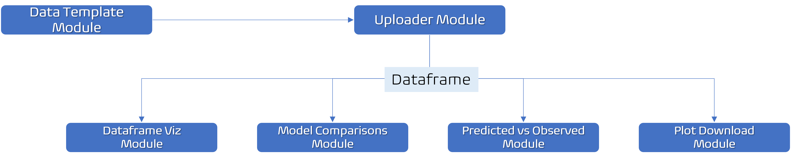

<!-- README.md is generated from README.Rmd. Please edit that file -->

```{r, include = FALSE}
knitr::opts_chunk$set(
  collapse = TRUE,
  comment = "#>",
  fig.path = "man/figures/README-",
  out.width = "100%"
)
```


# modEval 

# Overview

<!-- badges: start -->
<!-- badges: end -->

The goal of __modEval__ package is to allow users to perform statistical model evaluation and comparisons easily and quickly.  

The package is being developed as part of the requirements of the package development course offered by [__Curso-R__](https://curso-r.com/).

## Installation

You can install the development version of modEval from [GitHub](https://github.com/) with:

``` r

# install.packages("devtools")
devtools::install_github("TEDS-91/modEval")

```

## Example

This is a basic example which shows how to run the __model_eval()__ function:

```{r}

library(modEval)

## Model evaluation - metrics

predicted <- data_template$`Full Model`

observed <- data_template$observed

model_eval(obs_values = observed, pred_values = predicted)

```

# The "model_eval_ui()" function

If you run __model_eval_ui()__ a graphical user interface will pop up on your screen. It is a shiny application where you are able to download a template __.xlsx__ file, fill it up with your own data and upload the __.xlsx__ to populate the app. 

# App architecture (diagram)

The diagram below shows the app architecture from the __model_eval_ui()__ function. 



### App screen

Below is the screen that pops up when the user runs the __model_eval_ui()__ function.


