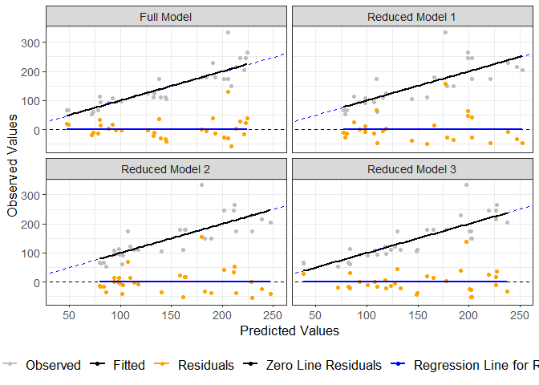

<!-- README.md is generated from README.Rmd. Please edit that file -->

# Overview

<!-- badges: start -->
<!-- badges: end -->

The goal of **modEval** package is to allow users to perform statistical
model evaluation and comparison. Package developed as part of the
requirements of the package development course offered by
[**Curso-R**](https://curso-r.com/).

## Installation

You can install the development version of modEval from
[GitHub](https://github.com/) with:

``` r
# install.packages("devtools")
devtools::install_github("TEDS-91/modEval")
```

## Example

This is a basic example which shows you how to solve a common problem:

``` r
library(modEval)

## Model evaluation - metrics

predicted <- data_template$`Full Model`

observed <- data_template$observed

model_eval(obs_values = observed , pred_values = predicted)
#> # A tibble: 1 x 11
#>   Intercept Slope `R-squared` `Peason Correlati~ `Mean Bias`     MAE   MSE  RMSE
#>       <dbl> <dbl>       <dbl>              <dbl>       <dbl>   <dbl> <dbl> <dbl>
#> 1   0.00480  1.00       0.734              0.857   -0.000313 9.77e-6 1209.  34.8
#> # ... with 3 more variables: CCC <dbl>, CD <dbl>, ME <dbl>
```

``` r
## Predicted vs Observed

plot_pred_obs(data_template)
```



# The “run_modelEvalUI()” function

If you run **run_modelEvalUI()** a graphical user interface will pop up
in your screen. It is a shiny application where you are able to download
a template **.csv** file, fill it up with your own data and upload the
**.csv** to feed to app.
