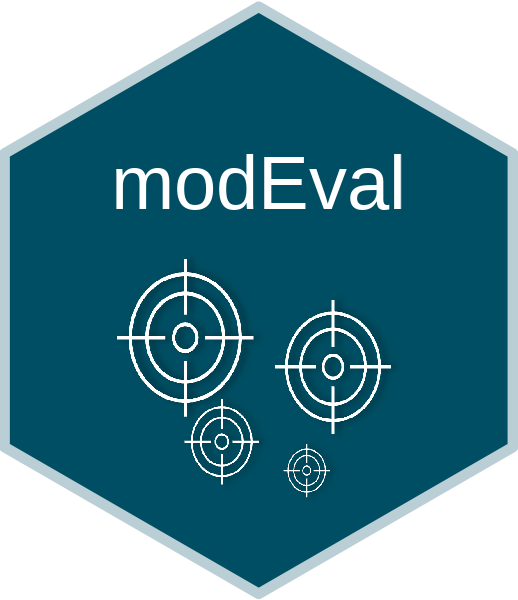
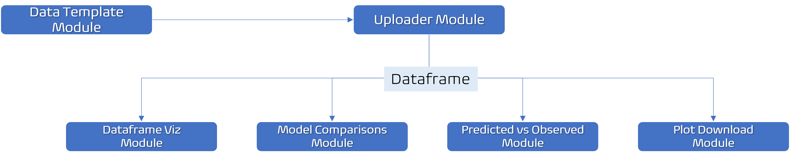
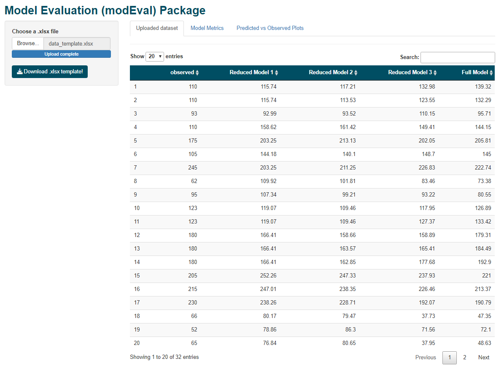

<!-- README.md is generated from README.Rmd. Please edit that file -->

# modEval 

# Overview

<!-- badges: start -->
<!-- badges: end -->

The goal of **modEval** package is to allow users to perform statistical
model evaluation and comparisons easily and quickly.

The key selling point of this package is the fact that the user needs
very little coding, and is able to use a graphical interface that will
make his life easier by running **model_eval_ui()**. The user will be
able to upload his/her data and calculate key adjustment model metrics,
visualize the data in the form of scatter plots and download them.

The package is being developed as part of the requirements of the
package development course offered by
[**Curso-R**](https://curso-r.com/).

## Installation

You can install the development version of modEval from
[GitHub](https://github.com/) with:

``` r
# install.packages("devtools")
devtools::install_github("TEDS-91/modEval")
```

## Example

This is a basic example which shows how to run the **model_eval()**
function:

``` r
library(modEval)

## Model evaluation - metrics

predicted <- data_template$`Full Model`

observed <- data_template$observed

model_eval(obs_values = observed, pred_values = predicted)
#> # A tibble: 1 x 25
#>   `P-value t test` `P-value variance homog~ Intercept `Intercept - p-valu~ Slope
#>              <dbl>                    <dbl>     <dbl>                <dbl> <dbl>
#> 1             1.00                    0.395   0.00480                 1.00  1.00
#> # ... with 20 more variables: Slope - p-value <dbl>, Joint F p-value <dbl>,
#> #   r <dbl>, r p-value <dbl>, r2 <dbl>, CCC <dbl>, Cb <dbl>, p <dbl>, MB <dbl>,
#> #   MAE <dbl>, RMSE <dbl>, MSE <dbl>, SB (%) <dbl>, SDSD (%) <dbl>,
#> #   LCS (%) <dbl>, Bias (%) <dbl>, Dev. of the regression  (%) <dbl>,
#> #   Random variation  (%) <dbl>, CD <dbl>, ME <dbl>
```

# The “model_eval_ui()” function

If you run **model_eval_ui()** a graphical user interface will pop up on
your screen. It is a shiny application where you are able to download a
template **.xlsx** file, fill it up with your own data and upload the
**.xlsx** to populate the app.

# App architecture (diagram)

The diagram below shows the app architecture from the
**model_eval_ui()** function.



### App screen

Below is the screen that pops up when the user runs the
**model_eval_ui()** function.


